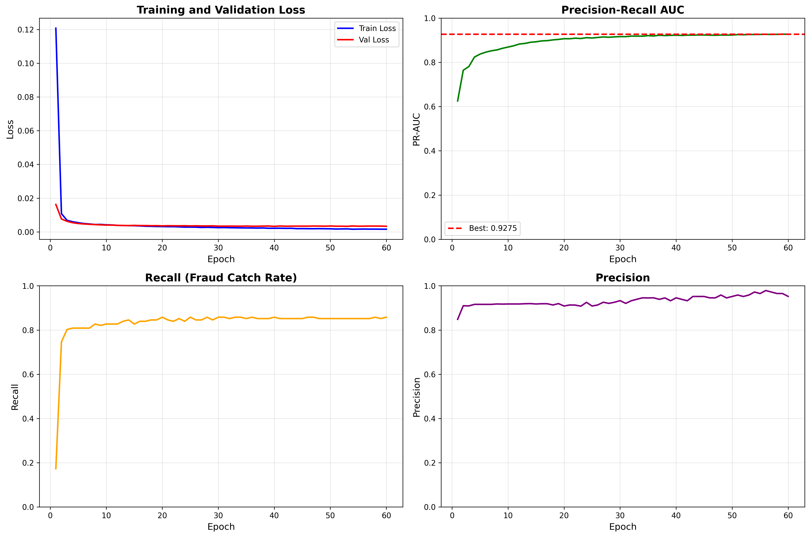

# Credit Card Fraud Detection

A deep learning approach to detecting fraudulent credit card transactions using PyTorch. The model achieves an **88.76% precision** and **80.61% recall** on highly imbalanced real-world transaction data, correctly identifying fraudulent transactions while maintaining an extremely low false positive rate.

## Dataset

This project uses the [Credit Card Fraud Detection](https://www.kaggle.com/datasets/mlg-ulb/creditcardfraud) dataset from Kaggle, which contains transactions made by European cardholders in September 2013.

- **284,807** total transactions
- **492** fraudulent transactions (0.172% of all transactions)
- **28** PCA-transformed features (V1-V28) + Time + Amount
- Highly imbalanced binary classification problem

## Model Architecture

A fully connected neural network built with PyTorch:

```
Input (29 features)
    |
Linear(29, 128) -> ReLU -> Dropout(0.17)
    |
Linear(128, 256) -> ReLU -> Dropout(0.17)
    |
Linear(256, 1) -> Sigmoid
```

**Hyperparameters** (tuned via Optuna):
- Learning rate: 7.94e-05
- Dropout rate: 0.173
- Hidden layers: [128, 256]
- Optimizer: Adam
- Loss function: Binary Cross-Entropy
- Batch size: 256
- Epochs: 60

## Handling Class Imbalance

The dataset is extremely imbalanced (~0.17% fraud). To address this, **SMOTE** (Synthetic Minority Oversampling Technique) is applied to the training set:

| | Count |
|---|---|
| Original frauds | 394 |
| After SMOTE (2.5x) | 985 |
| Synthetic frauds created | 591 |

SMOTE is applied conservatively (2.5x) to avoid overfitting on synthetic samples while still providing the model enough fraud examples to learn from.

## Data Preprocessing

1. **Log transformation** on the `Amount` feature to reduce skewness
2. **Standard scaling** on the log-transformed amount
3. **Dropped** `Time`, raw `Amount`, and intermediate `Amount_Log` columns
4. **Train/test split**: 80/20 with stratification
5. **Validation split**: 20% of the training set

## Results

### Training History



### Training Progress

| Epoch | Train Loss | PR-AUC | Recall |
|-------|-----------|--------|--------|
| 5     | 0.0059    | 0.8312 | 0.8021 |
| 15    | 0.0043    | 0.8998 | 0.8125 |
| 30    | 0.0030    | 0.9404 | 0.8542 |
| 45    | 0.0023    | 0.9592 | 0.8750 |
| 60    | 0.0019    | 0.9687 | 0.8958 |

### Test Set Evaluation

| Metric | Score |
|--------|-------|
| **PR-AUC** | 0.8220 |
| **Precision** | 0.8876 |
| **Recall** | 0.8061 |
| **F1-Score** | 0.8449 |

### Confusion Matrix

|  | Predicted Legitimate | Predicted Fraud |
|---|---|---|
| **Actual Legitimate** | 56,854 (TN) | 10 (FP) |
| **Actual Fraud** | 19 (FN) | 79 (TP) |

- Out of **98** actual frauds, the model correctly identified **79**
- Only **10** legitimate transactions were falsely flagged out of **56,864**
- Overall accuracy: **99.95%**

## Project Structure

```
Credit-Card-Fraud-Detection/
├── models.py                        # Neural network architecture and Trainer class
├── train_nn.py                      # Training script (data loading, preprocessing, training)
├── NN_hyperparameter_tuning.ipynb   # Optuna hyperparameter optimization notebook
├── all_models/                      # Saved model weights and Optuna study
│   └── nn_optuna_study.pkl
├── .gitignore
└── README.md
```

## Setup

### Installation

```bash
git clone https://github.com/manas-1404/credit-card-fraud-detection.git
cd Credit-Card-Fraud-Detection
python -m venv .venv
.venv\Scripts\activate      # Windows
# source .venv/bin/activate  # Linux/macOS
pip install torch numpy pandas scikit-learn imbalanced-learn kagglehub matplotlib seaborn
```

### Training

```bash
python train_nn.py
```

The script will automatically download the dataset from Kaggle (requires `kagglehub` authentication), preprocess the data, train the model, and print evaluation results.

## Tech Stack

- **PyTorch** - Neural network framework
- **scikit-learn** - Data splitting, scaling, evaluation metrics
- **imbalanced-learn** - SMOTE oversampling
- **Optuna** - Hyperparameter optimization
- **Kaggle Hub** - Dataset downloading
- **Matplotlib / Seaborn** - Visualization
